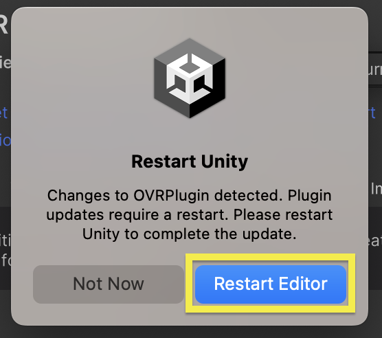
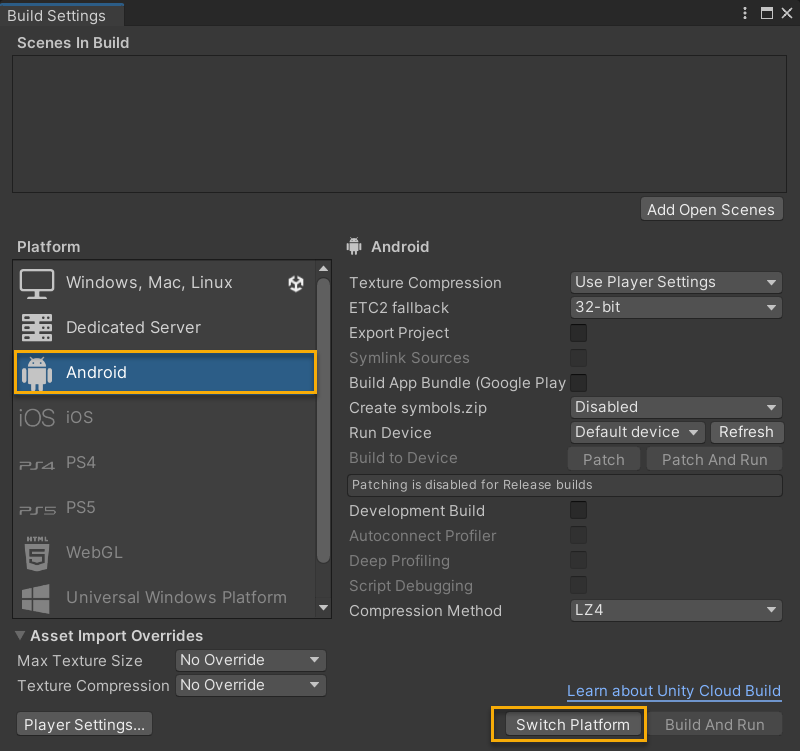
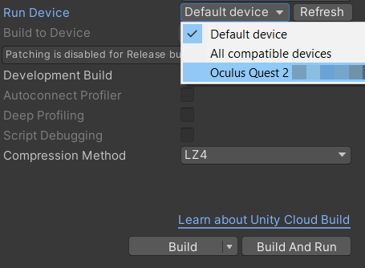
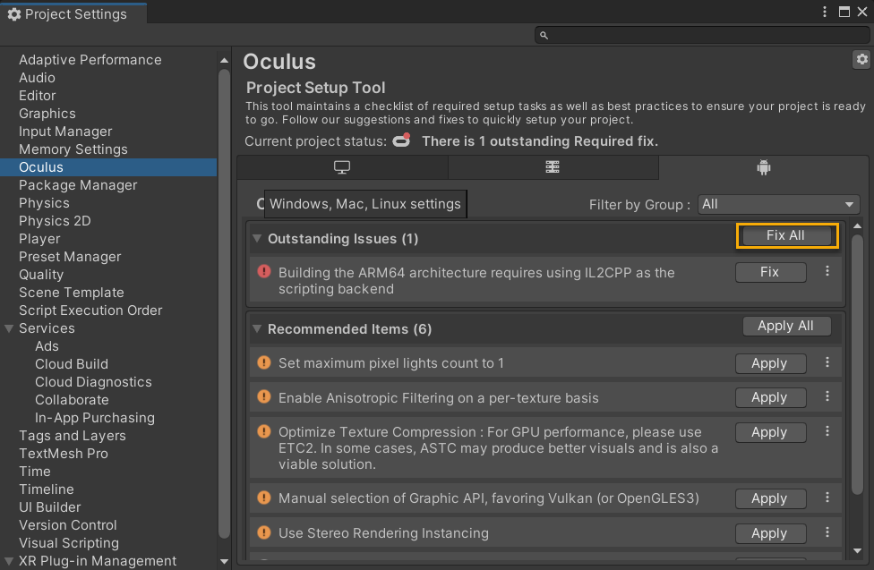
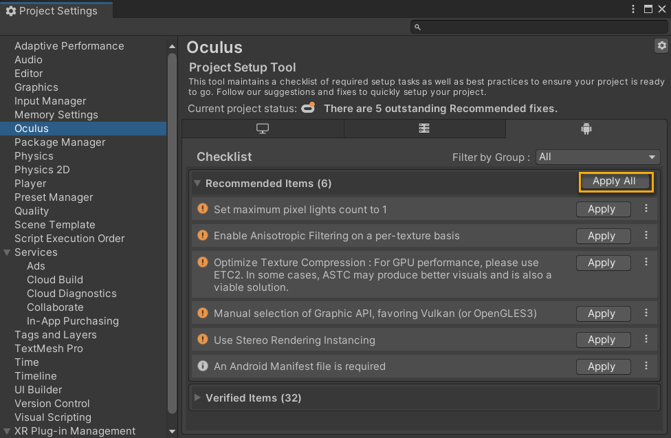
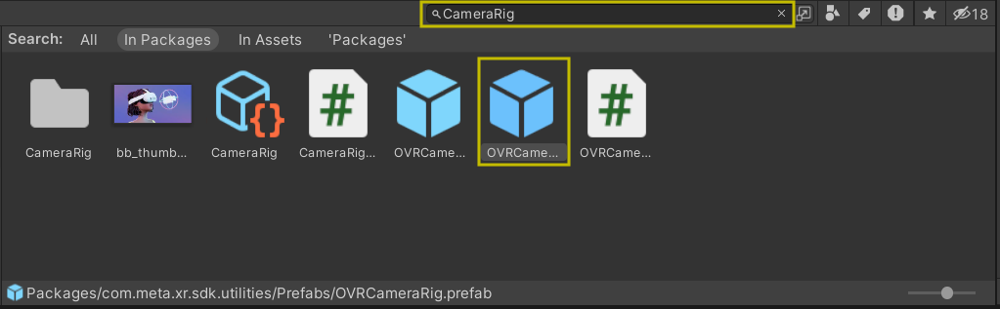
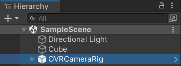
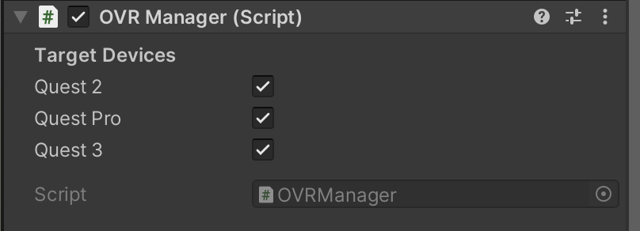
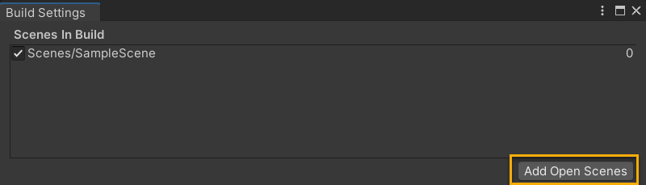
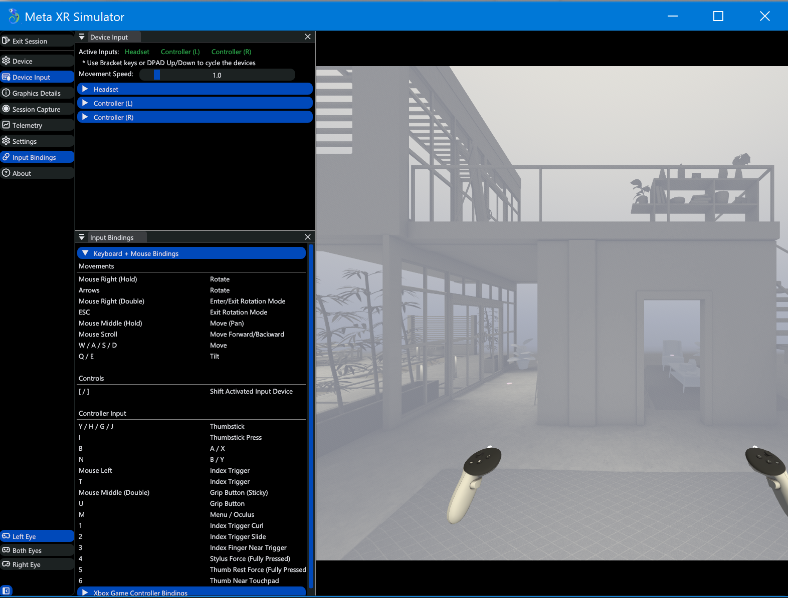

Project creation and environment setup:

- Install Unity Editor
   - The minimum supported Unity version for Meta app development is 2021 LTS. I am using 2022.3.9f1
   - Download Unity Hub and install it. On the installs tab select Install editor and choose Unity version 2022.3.9f1.
- On the **Add Modules** window under **Platforms** select **Android Build Support** checkbox and then select **Android SDK &NDK Tools** and **Open JDK** checkboxes.
- Complete the installation.
- Creating a VR project in Unity
  - Open Unity Hub
  - On the projects tab, click New project. Select version 2022.3.9f1 for editor version.
- Select **3D Core template**
- Enter project name, location, and then click **Create Project**

Download Meta XR All-in-One SDK

1. Once inside the app navigate to Window > Package Manager to open the Unity Package Manager pane.

2.Go to the Unity Asset Store page and log in if needed.
https://assetstore.unity.com/packages/tools/integration/meta-xr-all-in-one-sdk-269657

3. Select Add to My Assets button.

4.Select Open in Unity to start the integration process with the Package Manager in Unity. If asked, allow Asset Store Links to be opened by Unity.

5. Wait for the Unity Package Manager window to open.

6. On the “Meta XR All-in-One SDK” pane, click Install.

7.When prompted to restart Unity, click Restart Editor.

8. Restart

Set up Build Settings

The target platform for Meta Quest headsets is Android and the final output is an .apk file.

1) In Unity Editor, go to File > Build Settings.
In the Platform list, select Android, and select Switch Platform.

2) Switch Platform

3) While still in the Build Settings window, focus on the Run Device list and select your Meta Quest headset. If you don’t see the headset in the list, ensure you have connected it properly and select Refresh.

4) Run Device settings

Run Unity Project Setup Tool:

1) Navigate to Oculus > Tools > Project Setup Tool. The Unity Project Setup Tool has rules for creating a new application with Meta Quest in Unity.

2) In the checklist under the Android icon tab of the Project Setup Tool, select Fix All.

This applies the required settings for creating Meta Quest XR apps, including setting the minimum API version, using ARM64, and installing the Oculus XR Plug-in and XR Plug-in Management package.

3) f you still see Recommended Items in the list, select Apply All.

This optimizes project settings for Meta Quest Unity apps, including texture and graphics settings.

Add OVRCameraRig to scene:

Meta XR Core SDK contains the OVRCameraRig prefab which is a replacement to Unity’s main camera. This means you can safely delete Unity’s main camera from the Hierarchy tab.

The primary benefit of using OVRCameraRig is that it offers the OVRManager component (OVRManager.cs script). OVRManager provides the main interface to the VR hardware.

Follow this process:

1) Under Hierarchy tab, right-click Main Camera, and select Delete.

2) In the Project tab, search for Camera Rig, and drag the OVRCameraRig prefab into your scene. Alternatively, drag it in the Hierarchy tab.

3) Ensure your project’s hierarchy looks like this:

4) Select OVRCameraRig in the **Hierarchy** tab.

5) With the OVRCameraRig selected in the Inspector, under the OVR Manager component, ensure your headset is selected under Target Devices.

Build and Run project on Headset:
1) Go to **File** > **Build Settings** and, under **Scenes**, select **Add Open Scenes**. This should list your open scene.

Select Build And Run and choose a name for your .apk file, for example, HelloWorld.apk.
Put on your Meta Quest to experience your Hello World app.
Note: For faster iteration times, you can use Meta Quest Link which helps you test your Unity projects without building your project. For details, read Use Meta Quest Link for App Development.

Additional troubleshooting steps

Error message Execution failed for task ':launcher:packageRelease'. A failure occurred while executing com.android.build.gradle.internal.tasks.Workers$ActionFacade...

You might have conflicts with a prior Android Studio installation on your computer. To resolve this, try deleting or renaming the debug.keystore and debug.keystore.lock files in your \Users\<username>\.android folder. Restart Unity, and build your project again.

For additional troubleshooting, read the Troubleshooting guide.

**META XR SIMULATOR:**

The Meta XR Simulator provides a lightweight XR runtime that runs on your development machine for rapid development and testing of XR applications. The Simulator is meant to be a drop-in replacement for the Mobile and PC XR runtimes following the same XR API specification. This allows the application to run in Unity’s Play mode or Unreal’s Preview mode without modification. The Simulator has a predefined input mapping schema and a user interface that provides information of how the runtime is compositing the final view, simulating input, and other features.

Prerequisites

-Your Unity project should be properly set up to run on Meta Quest devices. If you are starting from scratch, feel free to refer to the steps in Build Your First VR App.

-Install Meta XR Simulator

1) On the menu, go to **Oculus** > **Download XR Simulator**. The NPM download page displays in your browser.
Click the cloud icon to download the latest tarball. It takes a few minutes for the latest com.meta.xr.simulator*.tgz to download fully.
On the menu, go to **Window** > Package **Manager**.
Click the **+** sign, and then select **Install package from tarball**.... Unity installs the tarball.
Close the **Package Manager** window.

**Start Meta XR Simulator**

Once you have imported the Meta XR Simulator, you must activate it. On the menu bar, go to **Oculus** > **Meta XR Simulator** > **Activate** to activate the simulator. There will be a log message titled **Meta XR Simulator is activated** indicating that the activation is successful.

Then, you can run your Unity application by clicking the Play button. The Debug Window of Meta XR Simulator will open. You can drag the panels to arrange them for your convenience.
